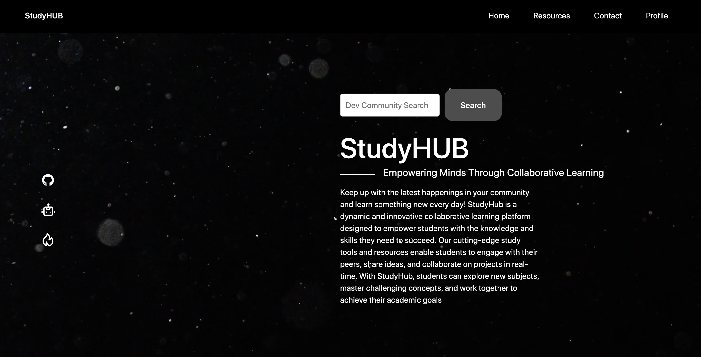

# Study-Hub
Study-Hub is an educational platform for web developer students and self-learners. It allows users to keep up-to-date with the latest technologies and learn new skills on their own time by keeping up with the latest  happenings in the community.

## Links

Deployed at: https://studyhub23.netlify.app/

## Description 

We created an application to help web developer students and self-learners to keep up-to-date with the latest technologies and learn new skills on their own time by utilizing happenings in the community. With Study-Hub, which is educational platform users can explore new subjects, master challenging concepts, and work together to achieve their academic goals. They also can explore their leraning journey with our step by step guide to becoming a Developer.

The app utilizes React, Vite, Bootstrap, node.js, Firebase, javaScript, Jquery, CSS, and HTML to deliver a user-friendly and visually appealing experience. To be able to see latest top articles in web development, dev.to API us used.

## Table of Contents (Optional)

* [Installation]
* [Usage]
* [License]

## Installation

1. Clone the repository to your local machine.
2. Install the required dependencies using npm install.
3. Start the app using npm run dev.
4. Open your browser and navigate to http://localhost:3000

## Usage 

To get started with the Study-Hub (online learning platform), simply follow these steps:

- Open the web-page in your web browser.
- Type the keyword or phrase related to web development topics you're interested in and hit "Enter" in the search bar.
- Browse through latest top articles from the dev.to community related to your search term.
- In Resources tab browse all your Web Development courses in one dashboard.
- View the web development skills and requirements for different types of roles
at Developer Roadmap" section.
- Screeshot of the Web Page:

## Contributors

Omar Malik - https://github.com/omalik92  
Sevda Seyidova - https://github.com/Helloseva  
Omar Ahmad - https://github.com/omar-ahm

## Future Directions 

- AI Assistant integration
- User Profile Functionality & Form connects
- Career Progression Solutions
- Course dashboard to integrate with further API's

## License

Please refer to the LICENSE in the repo.